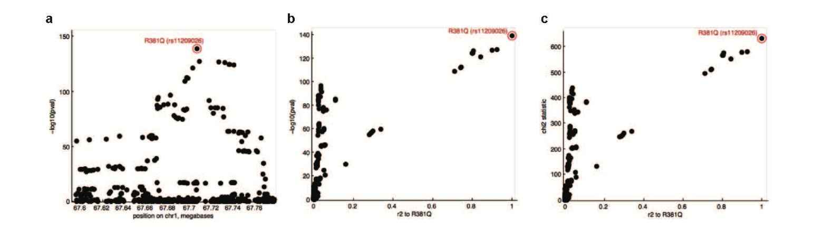

If you know the causal SNP in a GWAS significant region, then -log10 p-values should get smaller as the R-square between causal SNP and other SNPs gets weaker, e.g. 



The suggestion here is that there are two regression lines, suggesting possibly two real causal variants. This could be induced by two causal variants, but it struck me that this could also just be due to a haplotype effect.

## Simulating haplotype effect

Imagine that there is a causal SNP, and it sits between two haplotype blocks. SNPs in block 1 are not correlated with SNPs in block 2. But SNPs in block 1 and 2 are all correlated with the causal SNP. For example an LD map might look something like this:

```{r echo=FALSE}
library(ggplot2)
library(reshape2)
library(mvtnorm)
library(knitr)
set.seed(100)
opts_chunk$set(warning=FALSE, message=FALSE, echo=FALSE, fig.width=5, fig.height=5)
```

```{r }
n <- 1000
nsnp <- 10

r <- matrix(0.8, nsnp, nsnp)
diag(r) <- 1

x1 <- rmvnorm(n, rep(0, nsnp), sigma=r)
x2 <- rmvnorm(n, rep(0, nsnp), sigma=r)

x1[1:500, nsnp] <- x2[1:500, 1]

for(i in 1:nsnp)
{
	x2[,i] <- x2[,i] + rnorm(n, sd=i/(nsnp*2))
	x1[,i] <- x1[,i] + rnorm(n, sd=(nsnp-i+1)/(nsnp*2))
}

x <- cbind(x1, x2)

melted_correlation_matrix <- melt(cor(x))
dot_dat <- data.frame(Var1=nsnp, Var2=nsnp, value=1)
ggplot(melted_correlation_matrix, aes(x=Var1, y=Var2, fill=value)) + 
	geom_tile() + 
	scale_fill_gradient(low="white", high="red") +
	theme(axis.text.x=element_text(angle=90, vjust=0.5, hjust=1)) +
	geom_point(data=dot_dat) +
	labs(x="SNP number", y="SNP number", fill="R-square")
```

This is a depiction of a correlation matrix, that SNP that sits in between the two large correlated blocks is our causal variant, marked by the black spot.

Simulate a trait where the causal SNP has an effect on it, calculate the p-values of each SNP against the trait.

```{r }
y <- x[,nsnp] + rnorm(n)

pval <- array(0, ncol(x))
rsq1 <- array(0, ncol(x))
rsq2 <- array(0, ncol(x))

for(i in 1:ncol(x))
{
	pval[i] <- -log10(coefficients(summary(lm(y ~ x[,i])))[2,4])
	rsq1[i] <- cor(x[,i], x[,nsnp])^2
	rsq2[i] <- cor(x[,i], x[,nsnp+1])^2
}
dat <- data.frame(pval=pval, rsq1=rsq1, rsq2=rsq2, label=rep(c("block1", "block2"), each=nsnp), stringsAsFactors=FALSE)
dat$label[nsnp] <- "causal"

```

If the causal variant is in the data, we can make the PIC plot - rsq against -log10 pval:

```{r }
ggplot(dat, aes(x=rsq1, y=pval)) + 
geom_point(aes(colour=label)) +
scale_colour_brewer(type="qual") +
labs(x="R-square with causal variant", y="-log10 p")
```

There is the expected linear relationship. If we didn't have that causal variant in the data, and we calculate the R-square against the best SNP in the data instead, we get the following relationship:

```{r }
ggplot(dat[-nsnp,], aes(x=rsq2, y=pval)) + 
geom_point(aes(colour=label)) +
scale_colour_brewer(type="qual") +
labs(x="R-square when causal variant missing", y="-log10 p")
```

This is a similar pattern to that seen in the PIC paper (fig 1).

## Single causal variant inside haplotype block

Note that it doesn't work if the causal variant resides neatly inside a single haplotype block. For example, imagine we change the causal variant:

```{r }
cv <- 8

dot_dat <- data.frame(Var1=cv, Var2=cv, value=1)
ggplot(melted_correlation_matrix, aes(x=Var1, y=Var2, fill=value)) + 
	geom_tile() + 
	scale_fill_gradient(low="white", high="red") +
	theme(axis.text.x=element_text(angle=90, vjust=0.5, hjust=1)) +
	geom_point(data=dot_dat) +
	labs(x="SNP number", y="SNP number", fill="R-square")
```

and run the simulation again:

```{r }
y <- x[,cv] + rnorm(n)

pval <- array(0, ncol(x))
rsq1 <- array(0, ncol(x))
rsq2 <- array(0, ncol(x))

for(i in 1:ncol(x))
{
	pval[i] <- -log10(coefficients(summary(lm(y ~ x[,i])))[2,4])
	rsq1[i] <- cor(x[,i], x[,cv])^2
	rsq2[i] <- cor(x[,i], x[,cv+1])^2
}
dat <- data.frame(pval=pval, rsq1=rsq1, rsq2=rsq2, label=rep(c("block1", "block2"), each=nsnp), stringsAsFactors=FALSE)
dat$label[cv] <- "causal"

```

This plot shows what happens if the true causal variant is in the data:

```{r }
ggplot(dat, aes(x=rsq1, y=pval)) + 
geom_point(aes(colour=label)) +
scale_colour_brewer(type="qual") +
labs(x="R-square with causal variant", y="-log10 p")
```

and this one shows what happens if that causal variant isn't present in the data:

```{r }
ggplot(dat[-cv,], aes(x=rsq2, y=pval)) + 
geom_point(aes(colour=label)) +
scale_colour_brewer(type="qual") +
labs(x="R-square when causal variant missing", y="-log10 p")
```

## Two causal variants in one haplotype block


```{r }
dot_dat <- data.frame(Var1=c(3, 8), Var2=c(3, 8), value=1)
ggplot(melted_correlation_matrix, aes(x=Var1, y=Var2, fill=value)) + 
	geom_tile() + 
	scale_fill_gradient(low="white", high="red") +
	theme(axis.text.x=element_text(angle=90, vjust=0.5, hjust=1)) +
	geom_point(data=dot_dat) +
	labs(x="SNP number", y="SNP number", fill="R-square")
```

```{r }
y <- x[,3] + 0.5 * x[,8] + rnorm(n)

pval <- array(0, ncol(x))
rsq1 <- array(0, ncol(x))
rsq2 <- array(0, ncol(x))

for(i in 1:ncol(x))
{
	pval[i] <- -log10(coefficients(summary(lm(y ~ x[,i])))[2,4])
	rsq1[i] <- cor(x[,i], x[,3])^2
	rsq2[i] <- cor(x[,i], x[,3+1])^2
}
dat <- data.frame(pval=pval, rsq1=rsq1, rsq2=rsq2, label=rep(c("block1", "block2"), each=nsnp), stringsAsFactors=FALSE)
dat$label[c(3,8)] <- "causal"
```

```{r }
ggplot(dat, aes(x=rsq1, y=pval)) + 
geom_point(aes(colour=label)) +
scale_colour_brewer(type="qual") +
labs(x="R-square with causal variant", y="-log10 p")
```

## Two causal variants in different haplotype blocks


```{r }
dot_dat <- data.frame(Var1=c(13, 8), Var2=c(13, 8), value=1)
ggplot(melted_correlation_matrix, aes(x=Var1, y=Var2, fill=value)) + 
	geom_tile() + 
	scale_fill_gradient(low="white", high="red") +
	theme(axis.text.x=element_text(angle=90, vjust=0.5, hjust=1)) +
	geom_point(data=dot_dat) +
	labs(x="SNP number", y="SNP number", fill="R-square")
```

```{r }
y <- x[,13] + 0.5 * x[,8] + rnorm(n)

pval <- array(0, ncol(x))
rsq1 <- array(0, ncol(x))
rsq2 <- array(0, ncol(x))

for(i in 1:ncol(x))
{
	pval[i] <- -log10(coefficients(summary(lm(y ~ x[,i])))[2,4])
	rsq1[i] <- cor(x[,i], x[,13])^2
	rsq2[i] <- cor(x[,i], x[,13+1])^2
}
dat <- data.frame(pval=pval, rsq1=rsq1, rsq2=rsq2, label=rep(c("block1", "block2"), each=nsnp), stringsAsFactors=FALSE)
dat$label[c(13,8)] <- "causal"
```

```{r }
ggplot(dat, aes(x=rsq1, y=pval)) + 
geom_point(aes(colour=label)) +
scale_colour_brewer(type="qual") +
labs(x="R-square with causal variant", y="-log10 p")
```

This recapitulates somewhat the pattern seen in PIC paper.

**Conclusions**

A causal variant that sits between haplotype blocks can induce the pattern seen in the PIC paper without requiring there to be two causal variants.
